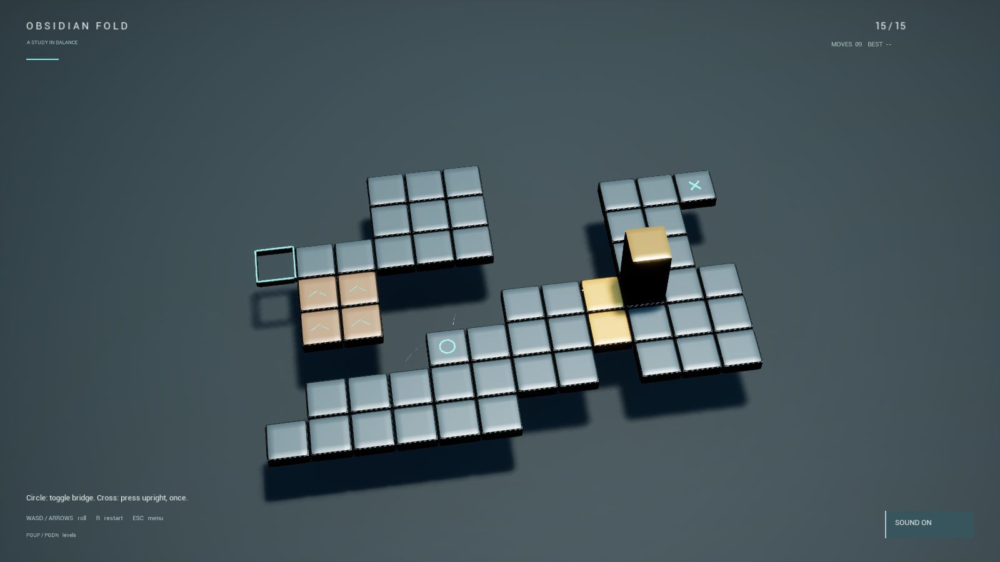

# Obsidian Fold

A deterministic C++ puzzle game for Unreal Engine 5.8, recreating the behavior and all 15 authored levels of the supplied Unity reference. Presentation uses beveled tiles, a metallic block, restrained teal/amber accents, animated bridges, synthesized sound, Niagara bursts, and a minimal HUD. No Friv branding or presentation assets are used.

## Architecture

`FBloxorzSimulation` accepts immutable level/state records and returns an attempted pose, outcome, new state, and changed flags. Integer grid coordinates and the explicit twelve-transition roll table determine every outcome; there are no world, collision, animation, or physics dependencies.

`ABloxorzBoard` owns a presentation state machine: Idle → Rolling → Idle/Falling/Completing. It rotates the mesh around the correct contact edge using a quaternion quarter-turn, then commits the pending logical state at landing. Falling preserves the last valid state. Bridge interpolation and particles never decide support. Grid Y maps to negative world Y so screen directions match the keyboard.

`ABloxorzPlayerController` maps input to discrete commands, with one short-lived buffered command during a roll. `ABloxorzHUD` draws scaled controls and modal panels. `UBloxorzProgress` stores best move counts and progression locally; unlock data is recorded, not enforced as a level-browsing gate.

Level/tile records and presentation timings are Blueprint-exposed. Place a Board actor and populate its Level to override the campaign with a custom puzzle. Extend tile behavior in the simulation rather than in effects actors. Cell size, roll/fall duration, camera feedback, and Niagara assets are exposed for tuning.

## Reference fidelity

All 15 authored levels are ported. Mechanics include fragile tiles, light toggle switches, upright-only one-shot heavy switches, linked bridges, falling, restart, three last-valid-state revives per level, and upright-only goals. No split-block mechanics exist in the supplied Unity implementation, so none were invented.

Fragile tiles fail only while upright and do not permanently disappear. Support is checked before switch effects, with no same-move recheck after a toggle. Light switches trigger for each occupied-cell landing, including overlap. These details follow the supplied reference rather than assumptions about the commercial game. `Docs/UnityCampaign.json` records extracted data; `BloxorzCampaign.cpp` is its runtime port.

## Controls

- Move: WASD or arrow keys
- Restart: R
- Enter / Space: revive, continue after completion, or resume menu
- Escape: menu; M: mute; Page Up / Down: browse levels
- Mouse: HUD panel buttons

Open `BloxorzUnreal.uproject` and press Play. The Puzzle map is intentionally empty: the game mode constructs the board at runtime.

## Build and tests

Validated with Unreal 5.8.3, VS 2022 MSVC 14.44, and Windows SDK 10.0.26100. Build `BloxorzUnrealEditor Win64 Development` with the engine's Build.bat and the absolute project path. Packaging settings include runtime Art, Audio, FX and the Puzzle map.

Run UnrealEditor-Cmd with `-ExecCmds="Automation RunTests Bloxorz; Quit" -unattended -nullrhi`. Five tests cover roll/tile rules, heavy switches and support ordering, twelve visual pivot endpoints, and breadth-first solvability of all fifteen levels.

For an actual rendered replay, use `/Game/Maps/Puzzle -game -RenderOffscreen -BloxorzLevel=13 -BloxorzReplay=UURRRDDLRUUUULULLLD -BloxorzCapture -BloxorzProfile -unattended`. Level indices are zero-based. Profile mode exits after twenty gameplay seconds and logs sampled real-time mean/p95 frame intervals following a three-second warm-up. Do not combine it with fixed-timestep `-benchmark`. This is a smoke measurement, not a shipping performance guarantee.

See [validation notes](Docs/Validation.md) for coverage and remaining manual checks.

## Asset provenance

Rounded mesh, materials, and synthesized sound cues were created for this project. `Tools/build_assets.py` rebuilds presentation assets through Unreal's Python commandlet; Python and Editor Scripting plugins are editor tooling. Niagara assets derive from Epic's bundled RadialBurst template and are subject to the Unreal Engine content license. Level layouts were supplied by the project owner; no ownership of the Bloxorz concept is claimed and no blanket third-party asset license is implied.
